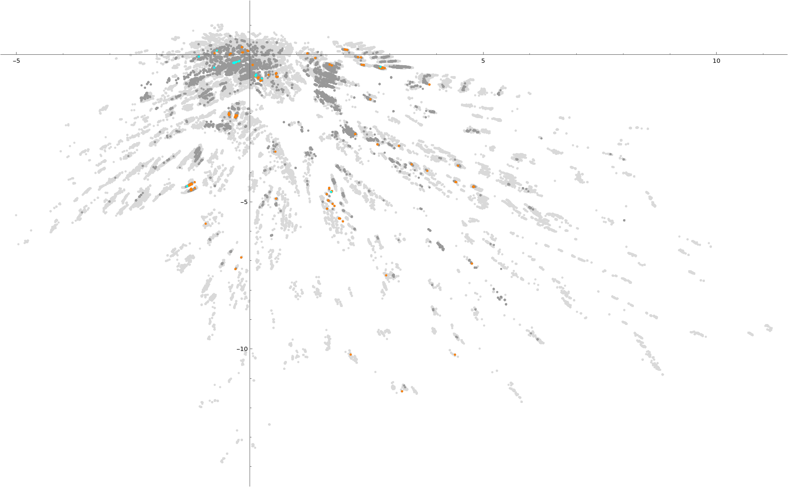

# Data

Results generated by each model can be found in the three folders above. They are saved in either .mx or .wdx Mathematica formats and can be imported as usual. If you have access to Mathematica 13.2 or later we suggest you download only the .mx versions of these files (*when given the option*) as they are much quicker to import. 

## List of Files and Descriptions
### clusters 
Contains each model (*in original randomized order*) and separated into 49 zip files (*containing .mx files*). The contents of each file has the following structure:

$$\\{\\{Outliers\\},\ \\{Cluster-N_2\\},\ \ldots,\ \\{Cluster-N_{176}\\}\\} \qquad \text{Length: 176}$$

where $N_i$ is the cluster's numerical label generated by *fastHDBSCAN*. 

Each, $\{Cluster-N_i\}$, contains an unspecified number of models sorted into their corresponding cluster. Each model contains 5 sub-elements which are: 

$$\\{\\{\text{x-coord},\ \text{y-coord},\ \text{cluster-label}\\},\ \\{\text{Gram Matrix}\\},\ \\{\text{Groups}\\},\ \\{(n_H-n_V+28\lambda_-),\ [\lambda_+,\lambda_-],\ T_{min},\ \text{Charged Reps}\\},\ \\{\text{vertex-labels}\\}\\}$$

Clusters are organized into Local Clusters (LC) which is given in file [cluster-families_idx-pos.csv](clusters/cluster-families_idx-pos.csv). The first row has the number 1 which corresponds to the index (*in Mathematica's numbering scheme*) of the corresponding element (*i.e. Outliers*). As an example, LC-02 which contains only cluster C-168 and is listed in Row 3 as element 169. 

**Example Mathematica code:**
```
files = FileNames["path-to-zip-files/*.zip"];
LCData = Import[#,{1,169}]&/@files;
```

A similar collection of models after the second clustering run can be found in the subfolder [LC-01](clusters/LC-01). The data is in a similar structure as before. Two files contain the relabeling/combining of sub-clusters in [redefine-sub-clusters_LC-01.csv](clusters/LC-01/redefine-sub-clusters_LC-01.csv) and collecting them into Local Sub-clusters (LSC) with labels given in [LC-01_Sub-clusters.csv](clusters/LC-01/LC-01_Sub-clusters.csv). The sub-cluster labels correspond to the last three digits of the number listed. So, SC-001 will have numerical label 1001 in the .csv file. 
**Note:** Rows now match with the LSC number, however, Outliers are still the first element in the raw data. 

**Example:** To import LSC-03 (i.e. row 3 with elements 1017 and 1018) pick elements 18 and 19 from the imported data. That is:
```
files = FileNames["path-to-zip-files/LC-01*.zip"];
LSCData = Import[#,{1,18,19}]&/@files;
```
### Classifier-0 and Classifier-1
The models predicted to be consistent are found in folder [classifier-0](classifier-0/) which contains all models predicted consistent in the zip file 'models-pred-zero.\*.zip' choose whichever format (*.mx or .wdx*) that suits your setup. We also include the list of models which were labeled as both consistent and inconsistent by the corresponding classifier. These are not separated into clusters and so each file contains a list of models, each with the same 5 elements as described above.  

### All Anomaly-free Models
The files labeled 'models-anomf-part*.zip' are a collection of models which pass all conditions (*minus anomaly-inflow*) for anomaly-cancellation. We provide this for convenience. In the plot below we show where these models appear in the latent layer. 

- **light-grey:** all models
- **dark-grey:** anomaly-free models
- **orange:** models with $(n_H-n_V+28\lambda_-) < 0$
- **light-blue:** models with $(n_H-n_V+28\lambda_-) = 0$




